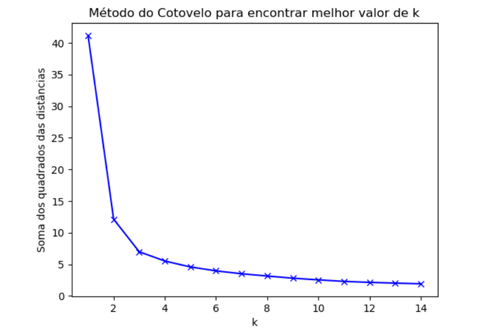
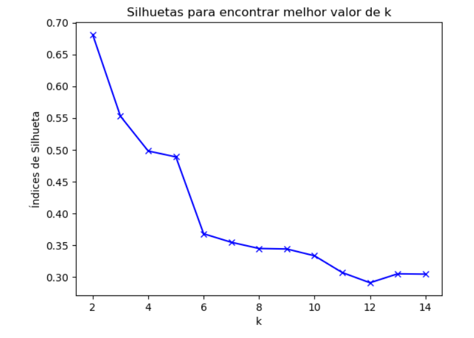

# Iris Dataset Clustering with K-Means

---

## About the Project

This project focuses on clustering the **Iris dataset** using the **K-Means algorithm**. The goal is to group the iris flowers into clusters based on their features (sepal length, sepal width, petal length, and petal width) and evaluate the performance of the clustering using metrics like the Adjusted Rand Index (ARI), Adjusted Mutual Information (AMI), and Silhouette Score.

---

## Iris Dataset

The **Iris dataset** is one of the most well-known datasets in machine learning and statistics. It contains 150 samples of iris flowers, divided into 3 species:
1. **Iris Setosa**
2. **Iris Versicolor**
3. **Iris Virginica**

Each species has 50 samples, and each sample is described by 4 features:
- **Sepal Length** (cm)
- **Sepal Width** (cm)
- **Petal Length** (cm)
- **Petal Width** (cm)

---

## Methodology

1. **Data Preprocessing**:
   - The categorical class column (`variety`) was transformed into numerical values.
   - Continuous features were normalized using `MinMaxScaler`.

2. **Clustering with K-Means**:
   - The K-Means algorithm was applied to the dataset.
   - The optimal number of clusters (\( k \)) was determined using the **Elbow Method** and **Silhouette Score**.

3. **Evaluation**:
   - The clustering results were evaluated using:
     - **Adjusted Rand Index (ARI)**
     - **Adjusted Mutual Information (AMI)**
     - **Silhouette Score**

---

## Results

### Elbow Method
The **Elbow Method** graph shows the relationship between the number of clusters (\( k \)) and the **sum of squared distances (SSE)**. The optimal number of clusters is **\( k = 3 \)**, as this is where the SSE begins to stabilize.

### Silhouette Score
The **Silhouette Score** analysis confirms that **\( k = 3 \)** is the optimal number of clusters, as it provides the highest score, indicating well-defined clusters.

### Evaluation Metrics
- **Adjusted Rand Index (ARI)**: 0.7302
- **Adjusted Mutual Information (AMI)**: 0.7551
- **Silhouette Score**: 0.5528

---

## Repository Structure

- **`iris.csv`**: The Iris dataset used in the project.
- **`notebook_analysis.ipynb`**: Jupyter Notebook containing the complete analysis, from preprocessing to evaluation.
- **`README.md`**: This file, providing an overview of the project.

---

## Technologies Used

- **Python**
- **Pandas** for data manipulation.
- **Scikit-learn** for implementing K-Means and evaluation metrics.
- **Matplotlib** for data visualization.

---

Feel free to explore the code, suggest improvements, or contribute to the project! 🚀
